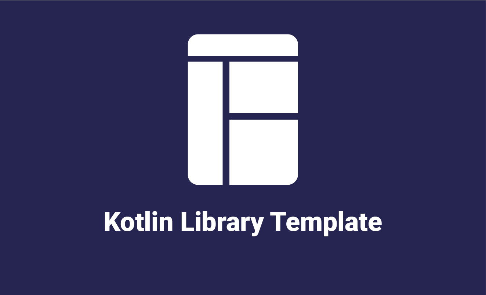

# kltemplate

[](https://github.com/mshdabiola/kltemplate/actions)
[](LICENSE)

<p align="center">
  
</p>

## Overview

**kltemplate** is a modern Kotlin Multiplatform library template designed to accelerate the development of cross-platform applications and libraries. It provides a robust, modular, and scalable foundation for targeting Android, JVM, and Web (WASM/JS) platforms using a single codebase.

The template leverages the latest Kotlin Multiplatform, Compose Multiplatform, and Gradle conventions, with a focus on clean architecture, testability, and developer experience.

---

## Features

- **Kotlin Multiplatform**: Shared business logic across Android, JVM, and Web (WASM/JS).
- **Compose Multiplatform UI**: Unified UI code for all supported platforms.
- **Modular Architecture**: Clear separation of features and core modules.
- **CI/CD Ready**: GitHub Actions workflows for build, test, and release.
- **Code Quality**: Integrated Detekt, Spotless, and Kover for linting, formatting, and code coverage.
- **Benchmarking**: Macrobenchmark and Baseline Profile support for Android.
- **Easy Dependency Management**: Centralized via `libs.versions.toml`.
- **Sample App**: Example usage for all supported targets.
- **Documentation & Changelog**: Well-documented code and automated changelog management.

---

## Project Structure

```
.
├── app/                # Multiplatform application entry points
├── library/            # Shared library modules (UI, model, etc.)
├── benchmarks/         # Android macrobenchmark and baseline profile
├── build-logic/        # Gradle convention plugins and build scripts
├── kotlin-js-store/    # JS-specific modules (if any)
├── gradle/             # Gradle wrapper and version catalogs
├── spotless/           # Formatting configuration
├── README.md
├── CHANGELOG.md
└── ...
```

---

## Getting Started

### Prerequisites

- [JDK 21+](https://adoptium.net/)
- [Android Studio Giraffe+](https://developer.android.com/studio)
- [Node.js](https://nodejs.org/) (for JS/WASM target)
- [Gradle 8.0+](https://gradle.org/) (wrapper included)

### Cloning the Repository

```sh
git clone https://github.com/mshdabiola/kltemplate.git
cd kltemplate
```

### Building the Project

Build all targets:

```sh
./gradlew build
```

Build and run the Android app:

```sh
./gradlew :app:installDebug
adb shell am start -n com.hobit.sample/.MainActivity
```

Build and run the JVM desktop app:

```sh
./gradlew :app:runJvm
```

Build and run the WASM/JS app (served locally):

```sh
./gradlew :app:jsBrowserDevelopmentRun
```

---

## Usage

### As a Template

1. **Clone or use as a GitHub template** to start your own multiplatform project.
2. **Rename packages** and update module names as needed.
3. **Add your business logic** to `library/` and UI to `app/`.

### As a Library

If you publish modules from `library/`, consumers can add dependencies via Maven Central or GitHub Packages (see [Publishing](#publishing)).

---

## Modules

- **app**: Entry points for Android, JVM, and WASM/JS.
- **library**: Shared UI components, models, and utilities.
- **benchmarks**: Android macrobenchmark and baseline profile tests.
- **build-logic**: Custom Gradle plugins for convention-driven builds.

---

## Development

### Code Style

- Follows [Kotlin Coding Conventions](https://kotlinlang.org/docs/coding-conventions.html).
- Run formatting and lint checks before committing:

```sh
./gradlew spotlessCheck detekt
```

### Testing

Run all tests:

```sh
./gradlew test
```

Run Compose UI tests (Android):

```sh
./gradlew :library:connectedAndroidTest
```

### Benchmarking

Generate and collect baseline profiles:

```sh
./gradlew :benchmarks:connectedAndroidTest
```

---

## Publishing

The template is pre-configured for publishing to Maven Central and GitHub Packages. Update `groupId`, `versionName`, and credentials in `gradle/libs.versions.toml` and GitHub secrets.

To publish:

```sh
./gradlew publish
```

---

## Contributing

Contributions are welcome! Please see [CONTRIBUTING.md](CONTRIBUTING.md) for guidelines.

- Open issues for bugs or feature requests.
- Submit pull requests with clear descriptions and tests.

---

## License

This project is licensed under the [Apache 2.0 License](LICENSE).

---

## Acknowledgements

- [JetBrains Compose Multiplatform](https://www.jetbrains.com/lp/compose-multiplatform/)
- [Kotlin Multiplatform](https://kotlinlang.org/docs/multiplatform.html)
- [Detekt](https://detekt.dev/)
- [Spotless](https://github.com/diffplug/spotless)
- [Kover](https://github.com/Kotlin/kotlinx-kover)

---

## Screenshot

<p align="center">
  
</p>